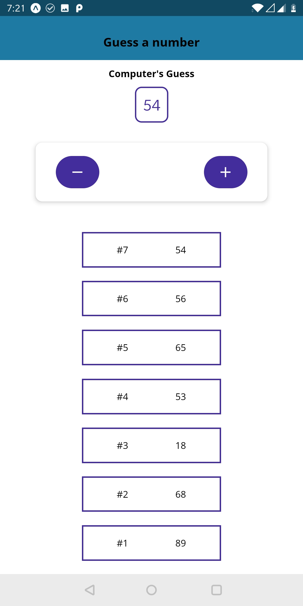
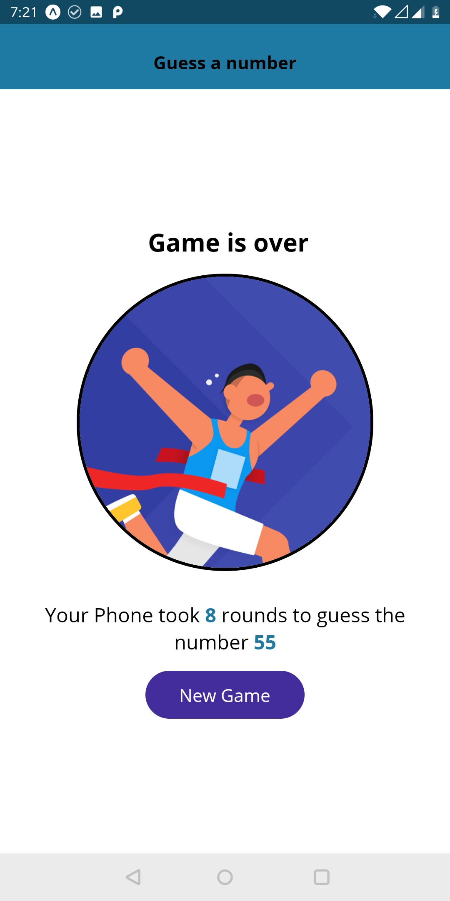

# NumberGuess
Download apk from here http://bit.ly/numbergues

This is basic game created using React-Native. 
First you have to choose any number. 
 

 
Computer then tries to guess the number by making random number generations. 
You have to tell whether actual number is lower or greater by using provided '+', '-' buttons. 
 

 
Game is over when correct guess is made. 
Game over screens shows how many attempts computer made.
 

